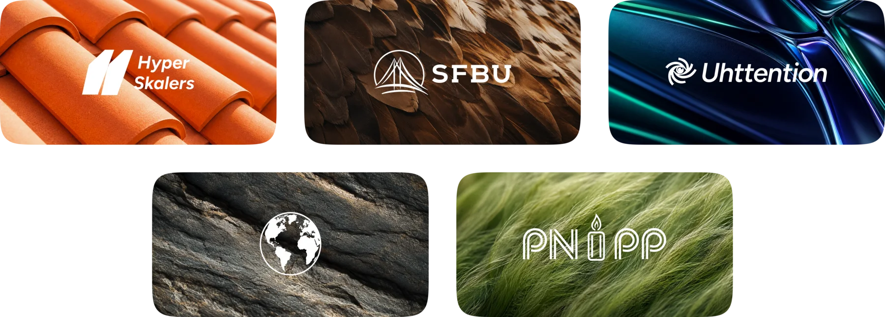
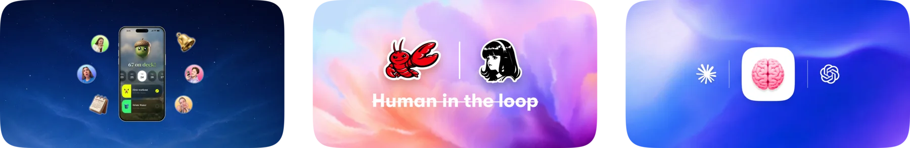
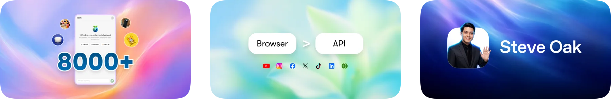

# Hi, I'm Oak 👋

Also called **Steve Oak / Okkar Kyaw**.

📍 Bay Area | 🤖 **Applied Agentic AI Engineer** | 🎨 **Design Engineer**

I build AI-native products that make model behavior easier to use, inspect, and trust: agents, retrieval systems, memory workflows, browser automation, mobile AI, and product-quality interfaces.

## What I Do

- **AI product engineering** - turn ideas into actual agent workflows, product systems, and user-facing AI experiences
- **Agentic development + applied AI** - agents, MCP, retrieval, memory, browser automation, eval loops, approval gates, agent skills/plugins, and reporting flows
- **Design engineering** - product surfaces, design systems, conversion UX, and interfaces people can understand fast

## Background

  

- ⚙️ 2026 - **[Agentic AI Engineer, HyperSkalers](https://steveoak.com/work#career-hyperskalers)** - applied AI systems for media buying, funnels, SEO/AEO, GTM, and client-specific memory
- 🎓 2024-2026 - **[M.S. Computer Science, San Francisco Bay University](https://steveoak.com/work#career-san-francisco-bay-university)** - graduate AI work, RAG, machine learning, and EcoSmartLoop capstone systems
- 📈 2024-2025 - **[AI Automation Engineer + Lead Designer, Uhttention](https://steveoak.com/work#career-uhttention)** - AI automation, conversion UX, Webflow CMS, lead-gen funnels, chatbots, and content workflows
- 🎬 2022-2024 - **[AI Workflow Engineer + Organic Funnel Marketing](https://steveoak.com/work#career-global-edtech-organization)** - creative AI workflows, marketing funnels, custom AI models, and social content systems
- 🧩 2018-2024 - **[Full-stack engineer, AI/ML + design systems](https://steveoak.com/work#career-pnpp-solutions)** - enterprise software, data products, reusable design systems, and early AI/ML features

## Selected Projects

### AI Products + Agents

  

- 🤖 **[Oakminder](https://steveoak.com/work/oakminder)** - reminder follow-through, voice-agent actions, native urgency, and distribution systems
- 🔗 **[LinkedIn Growth Loop](https://steveoak.com/work/linkedin-growth-loop)** - high-autonomy agent teams for relationship work with browser control and validation
- 🧠 **[Agentic Brain](https://steveoak.com/work/agentic-brain)** - short-term and long-term memory systems for AI agents and agentic development

### Applied AI + Product Systems

  

- ♻️ **[EcoSmartLoop](https://steveoak.com/work/ecosmartloop)** - AI sorting model and AI agent platform for a $640B waste problem and 450K California businesses
- 📣 **[OmniSocial](https://steveoak.com/work/omnisocial)** - agentic content production with browser harness
- 🧭 **[SteveOak.com](https://steveoak.com)** - human-readable portfolio + machine-readable profile, Markdown, JSON, and LLM surfaces

### Earlier Projects

- 🧶 **[Craftie Universe](https://independent-performance-642823.framer.app/codex/personal-software-era-ai)** - AI hackathons, craft apps, and personal software experiments
- 🍵 **[Matcha by Maryam](https://independent-performance-642823.framer.app/codex/matchabymaryam)** (Design Focused) - brand, website, and app work for an exclusive matcha community
- ⚡ **[Spark.it](https://independent-performance-642823.framer.app/codex/ai-automation-cloud)** - building software with agentic tools, development workflows, and systems
- 📈 **[Uhttention Partners](https://independent-performance-642823.framer.app/codex/b2b-b2c-growth)** (Design Focused) - growth design, software launches, and conversion systems
- 🧪 **[Weird, Fun & Impact](https://independent-performance-642823.framer.app/codex/weird-fun-impact)** - games, dashboards, public-good tools, and creative tech
- 📱 **[mmLink & Concepts](https://independent-performance-642823.framer.app/codex/research-to-redesign)** (Design Focused) - telecom redesign, UX concepts, and early product design work

## Connect

[-0077B5?style=flat-square&logo=linkedin&logoColor=white)](https://www.linkedin.com/in/whoisoak/)

---

### Philosophy

> Good AI work is product work: transparent workflows, visible feedback, useful interfaces, and enough taste to make the system feel real.

Currently focused on applied AI products, agentic development, and design-engineered workflows that move from idea to usable product.
